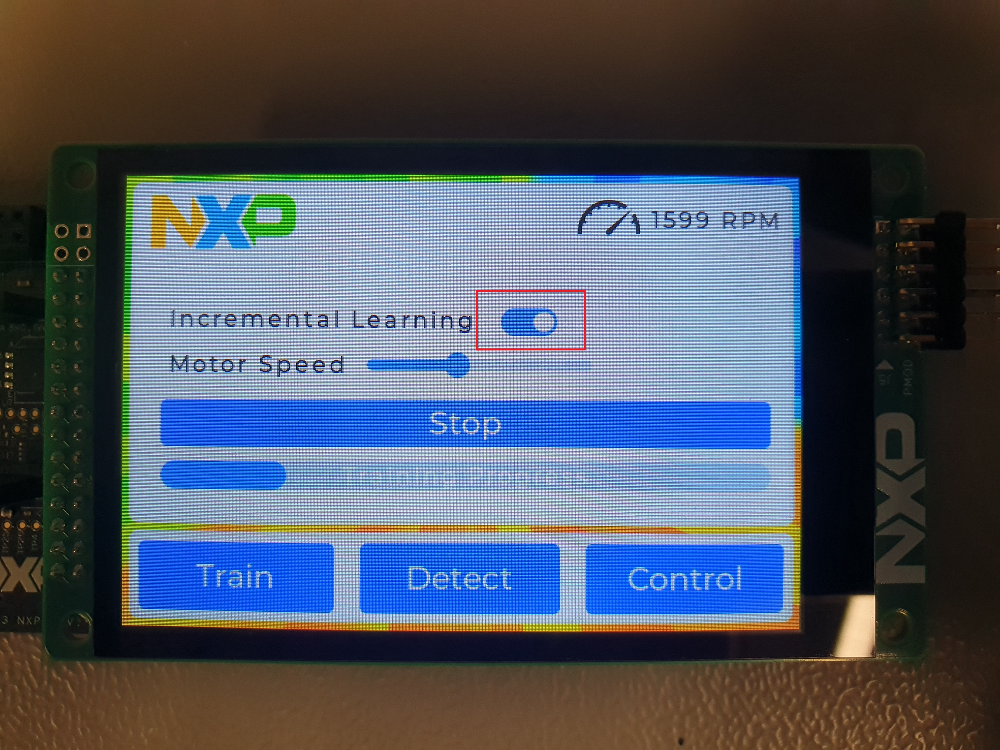

# NXP Application Code Hub

## ML Sensorless Anomaly Detection on FRDM-MCXN947
This user guide provide user with information on how to setup and use Sensorless Anomaly Detection demo on FRDM-MCXN947 Board. The readme guides user through basic HW and SW setup followed by intermediate procedures to collect data using FreeMASTER and define a custom model using a Time Series Studio tool.

 
 

The goal of this demo is to showcase integration of many NXP tools into a single solution. This demo utilizes MCUXpresso SDK for basic drivers, LVGL support for GUI and PMSM motor control algorithms. Using GUI Guider, a modern and easy to navigate user interface is developed. Next, the demo incorporates FreeMASTER real time debugging tool to collect datasets using the Machine Learning Universal Datalogger project, which is also available as a standalone project on the Application Code Hub. This dataset can be used to develop a custom anomaly detection model using the Time Series Studio tool which is a part of eIQ® Toolkit.

The application uses motor control algorithms to drive a motor with attached fan blade. This sensorless setup is used as a baseline for sensorless anomaly detection using Machine Learning algorithms.

ML Anomaly detection (AD) is a task where only normal operating conditions of a system are known. The goal of the AD model is to learn those normal operating conditions and anything that does not represent the same system state should be classified as an anomaly. In this application, the anomaly is detected without any additional sensors and as such represents a cost-effective solution. Anomalies are detected using values of speed (calculated) and Iq current (measured anyway for purposes of driving the motor).

Following is a video overview of the [demo in action](https://github.com/nxp-appcodehub/dm-ml-sensorless-anomaly-detection/tree/main/images/video.mov)

<video width="640" height="360" controls>
  <source src="images/video.mp4" type="video/mp4">
</video>

#### Boards: FRDM-MCXN947
#### Categories: HMI, AI/ML, Motor Control, Anomaly Detection, Graphics, User Interface
#### Peripherals: DISPLAY, DMA, PWM, TIMER, UART
#### Toolchains: MCUXpresso IDE

## Table of Contents
1. [Software](#step1)
2. [Hardware](#step2)
3. [Hardware Setup](#step3)
4. [Software Setup](#step4)
5. [Support](#step5)
6. [Release Notes](#step6)

## 1. Software
-   MCUXpresso IDE v11.9.0+ ([link](https://www.nxp.com/design/design-center/software/development-software/mcuxpresso-software-and-tools-/mcuxpresso-integrated-development-environment-ide:MCUXpresso-IDE))
-   eIQ Toolkit v1.13.1+ (With eIQ Portal v2.13.1+) ([link](https://www.nxp.com/design/design-center/software/eiq-ml-development-environment/eiq-toolkit-for-end-to-end-model-development-and-deployment:EIQ-TOOLKIT))
-   FreeMASTER v3.2.4.3+ ([link](https://www.nxp.com/design/design-center/software/development-software/freemaster-run-time-debugging-tool:FREEMASTER))

## 2. Hardware
-   FRDM-MCXN947 Board
-   LCD-PAR-S035 3.5” 480x320 IPS TFT LCD Module
-   FRDM-MC-LVPMSM Freedom Development Platform for Low-Voltage, 3-Phase PMSM Motor Control
-   24V 3.75Amps Power Supply for FRDM-MC-LVPMSM
-   Teknic M-2311P-xx-xxD Motor (or different, but this would require manual parameter setting - see [step 4.3](#step4_3))
-   USB-C cable

 

## 3. Hardware Setup
-   Before connecting all the hardware together, please desolder the connection on SJ10. This connection should not be connected to either side as shown in the following image. Without doing so the FRDM-MC-LVPSM board would interfere with the display.

 

-   After modifying the board, connect all the shields as shown in the image below and continue with connecting power supply and USB-C cable.

 
 

-   Optionally attach a fan blade of your choice to the motor (Please be careful and put the motor with the blade to an enclosure to prevent injury).

  

## 4. Software Setup
### 4.1 Download and Install required Software
-   Download and Install MCUXpresso IDE 11.9.0 or later
-   Download and Install MCUXpresso SDK v2.16.0 for FRDM-MCXN947
-   Optionally for data collection and model development:
    -   Download and Install eIQ Toolkit v1.13.1 or later
    -   Download and Install FreeMASTER v3.2.4.3 or later

### 4.2  Import demo from Application Code Hub
-   Launch MCUXpresso IDE and switch to any workspace
-   Click on Import from Application Code Hub (Image below)
-   Search for ML Sensorless Anomaly Detection on FRDM-MCXN947
-   Select this demo and click "GitHub link" in the top portion of the window
-   Continue with "Next", make sure the project is selected on the final page and click "Finish"

  

### 4.3  Optional: Set motor parameters
-   If you are using different type of motor, please edit /source/m1_pmsm_appconfig.h file updating it with parameters of your own motor. However, note that using Teknic M-2311P-xx-xxD is recommended.

### 4.4 Run the demo
-   Click "Build" to build the project.
-   After the build is successfully finished, click "Debug" to flash the project to the board. 
-   When the code entry point is reached, click continue to run the demo.
-   If you have done everything correctly you should see the GUI on the display (As shown in the following image).

 

### 4.5 Train the model
-   Switch to the Train tab using the bottom navigation bar if you are not already there
-   Using the slider set the speed that will be used for training (Min: 0 RPM, Max: 3400 RPM)
-   Click Train to start the training process
-   Wait for training to finish
-   Set speed and conditions around the system (e.g. barrier in front of the fan blade) during the training will define the learned normal state, anything outside of these conditions should be treated as anomaly of varying degree.
-   To optimize precision of the detection, you can modify number of samples taken for each channel (definition ML_SAMPLES_PER_CHANNEL) as well as time between samples (definition ML_SAMPLE_STEP). Both definitions are located in main.c
-   Note: You might need to collect new data (see [step 4.9](#step4_9)) and define a new model (see [step 4.10](#step4_10)) for the model to have inputs compatible with your new settings

### 4.6 Incremental training
-   After the model is trained, you can retrain it to different normal state by hitting the Train button again. If you want to only update the current model with new normal states (such as different speeds which should all be treated as normal), simply switch the Incremental Learning to ON state as shown in the next image
-   If you click the Train button now, the model will proceed to updating the model with additional normal states

 

### 4.7 Anomaly Detection
-   Using the bottom navigation bar switch to the Detect tab
-   Set Motor speed using the slider and turn the motor on using the Run Motor switch
-   Switching Run ML to ON state will run the anomaly detection
-   Slider and Label in the right part of the display show current prediction. The more is the slider filled, the closer is current state to the normal status. As the anomaly score increases, the health of the fan degrades until it is lower than TSS_RECOMMENDED_THRESHOLD, at this point the slider will turn red and the status will change to Anomaly. Everything, that is outside training values should be treated as an anomaly, you might need to tune the threshold value to get the best results. Also, the included model is for showcase purposes and to get better results, you would need to collect data yourself for your specific setup and develop a new, more optimized model using our Time Series Studio tool.

 

### 4.8 Control Tab
-   Controlling the motor from this tab is the same as in the Detect tab ([step 4.7](#step4_7)) with addition of a list of physical quantities that are driving the motor.

 

### 4.9 Data collection
-   For data collection, the demo uses another tool available from the Application Code Hub. This tool is "ML Universal Datalogger for FreeMASTER" and more information about it is available at this [link](https://github.com/nxp-appcodehub/ap-ml-universal-datalogger-for-freemaster). 
-   Set length of channel and sampling frequency by modifying ML_SAMPLES_PER_CHANNEL and ML_SAMPLE_STEP in main.c 
-   A simple datalogger is implemented in this demo. To collect data, please enable MLUD in the code by setting ENABLE_MLUD to 1 in main.c and reflash the code to the board.
-   Start FreeMASTER and open the project located in MLUD_FreeMASTER folder
-   Go to Project->Options->MAP Files and make sure that the Default symbol file points to DEMO_DIR/Debug/FAN_Anomaly.axf
-   Make sure the application is running on the board
-   Connect FreeMASTER to the board by clicking GO! in the toolbar in the top portion of the screen
-   Reload the Datalogger page using the reload button in the same toolbar
-   Set the destination folder. This is relative path to the FreeMASTER project directory. Note: Make sure the destination folder exists before starting the measurement (for more information see ML Universal Datalogger README file on this [link](https://github.com/nxp-appcodehub/ap-ml-universal-datalogger-for-freemaster)).
-   Set name and requested number of measurements.
-   Start the motor using any control tab on the board display
-   Start the collection process by clicking "Start measurement" in the FreeMASTER window.
-   Wait for the collection to finish

 

### 4.10 Model Development
-   Start eIQ Portal (which is a part of eIQ Toolkit installation)
-   From eIQ Portal start the Time Series tool.
-   From left-side menu select Anomaly Detection
-   Hit "Create New Project", fill in name, from targets select MCXN947, Number of Channels set to 2 (in this demo I_q current and Speed are used, but you can modify the code to use different variables or more samples per variable to get better results)
-   Click "Confirm & Create"
-   Click "Load Normal Data" and navigate to the data you collected in the [step 4.9](#step4_9).
-   Select as many files representing normal operation as you want
-   Set separator to Tab and load the files
-   Do the same for Anomalous data
-   Switch to the Training tab (top of the screen) and click "Start New Training"
-   Switch "On-Device Learn" to ON, you can leave Train / Val ratio as is
-   Click "Start" and wait for the training to automatically find suitable models for you
-   Switch to Emulation Tab and select a model with suitable Accuracy and reasonable RAM and Flash requirements
-   Go to Deployment tab, from the dropdown menu select the model you chose in the previous step
-   Make sure Library is selected under Generate button and MCUXpresso is selected as an IDE
-   Click Generate and save the model to you PC
-   Copy all files from the generated zip to the MCUXpresso project folder DEMO_DIR/source/tss_model
-   Rebuild and run the demo with a new model. Note: Without License, you will be able to run the model inference only 1000 times, after that, you will need to reboot the system. To prevent using up all 1000 inferences, set larger value for GUI_PREDICT_FREQ in main.c (but expect some missed anomalies) or sign up for an unlimited Time Series Studio license.
-   For more information about Time Series Studio workflow and capabilities, please refer to the documentation available right within the tool's menu tab

 

## 5. Support
If you need help, please create an issue within this repository or create a ticket to [NXP Community](https://community.nxp.com/).

#### Project Metadata

<!----- Boards ----->

<!----- Categories ----->

<!----- Peripherals ----->

<!----- Toolchains ----->

Questions regarding the content/correctness of this example can be entered as Issues within this GitHub repository.

>**Warning**: For more general technical questions regarding NXP Microcontrollers and the difference in expected functionality, enter your questions on the [NXP Community Forum](https://community.nxp.com/)

## 6. Release Notes
| Version | Description / Update                           | Date                        |
|:-------:|------------------------------------------------|----------------------------:|
| 1.0     | Initial release on Application Code Hub        | December 12th 2024 |

<small>
<b>Trademarks and Service Marks</b>: There are a number of proprietary logos, service marks, trademarks, slogans and product designations ("Marks") found on this Site. By making the Marks available on this Site, NXP is not granting you a license to use them in any fashion. Access to this Site does not confer upon you any license to the Marks under any of NXP or any third party's intellectual property rights. While NXP encourages others to link to our URL, no NXP trademark or service mark may be used as a hyperlink without NXP’s prior written permission. The following Marks are the property of NXP. This list is not comprehensive; the absence of a Mark from the list does not constitute a waiver of intellectual property rights established by NXP in a Mark.
</small>
 
<small>
NXP, the NXP logo, NXP SECURE CONNECTIONS FOR A SMARTER WORLD, Airfast, Altivec, ByLink, CodeWarrior, ColdFire, ColdFire+, CoolFlux, CoolFlux DSP, DESFire, EdgeLock, EdgeScale, EdgeVerse, elQ, Embrace, Freescale, GreenChip, HITAG, ICODE and I-CODE, Immersiv3D, I2C-bus logo , JCOP, Kinetis, Layerscape, MagniV, Mantis, MCCI, MIFARE, MIFARE Classic, MIFARE FleX, MIFARE4Mobile, MIFARE Plus, MIFARE Ultralight, MiGLO, MOBILEGT, NTAG, PEG, Plus X, POR, PowerQUICC, Processor Expert, QorIQ, QorIQ Qonverge, RoadLink wordmark and logo, SafeAssure, SafeAssure logo , SmartLX, SmartMX, StarCore, Symphony, Tower, TriMedia, Trimension, UCODE, VortiQa, Vybrid are trademarks of NXP B.V. All other product or service names are the property of their respective owners. © 2021 NXP B.V.
</small>